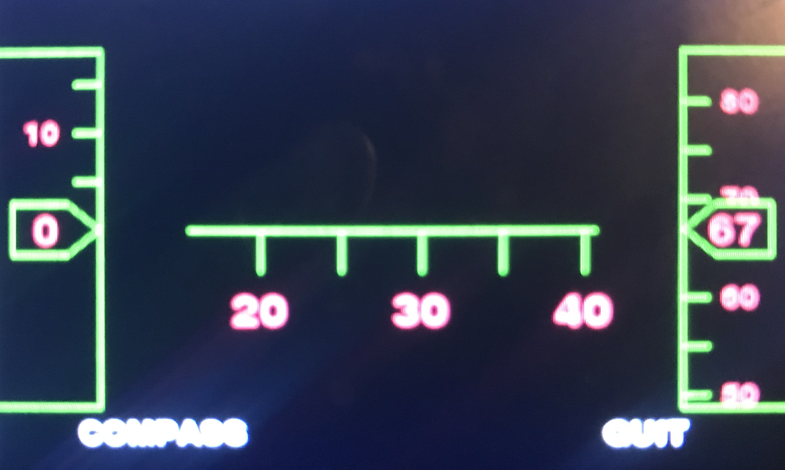

# JHUD

## Source Projects
JHUD is modified under a GPL-2.0 license the source may be found [here](https://github.com/peterh/pyobd) and [here](https://courses.ece.cornell.edu/ece5990/ECE5990_Spring16_FinalProjects/wjv29_xz245/index.html).

## Development
The original source projects did a great job of laying down a general path for what I hoped to accommplish however the uniqness of what I hoped to build meant that I would have to stray from their beat down path. A number of technologies such as the motion sensor no longer existed as new versions had replaced the old so new code had to be written to deal with newer versions. I also had to compeletely rework the UI for the new HUD. Lastly I had too buy, soder and install all hardware while ensuring it would be resistant to what ever stresses I would be putting the pi and sensors through. 
